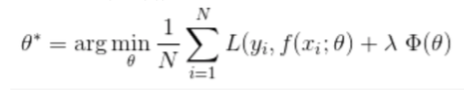
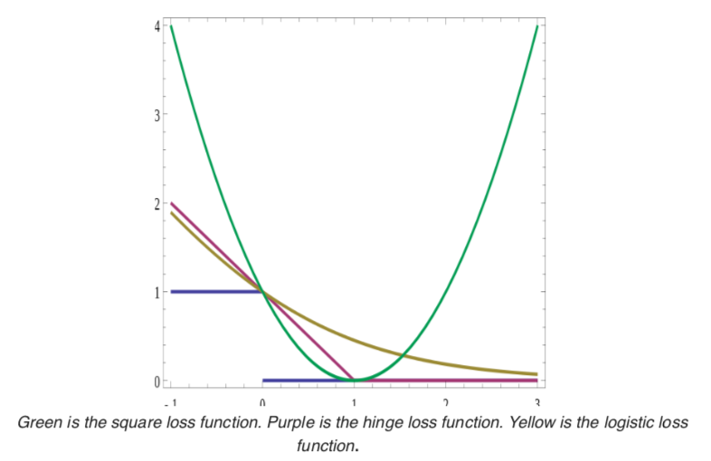
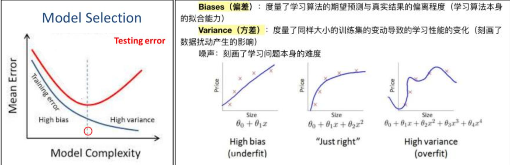
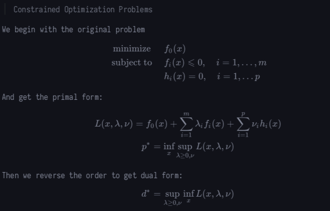
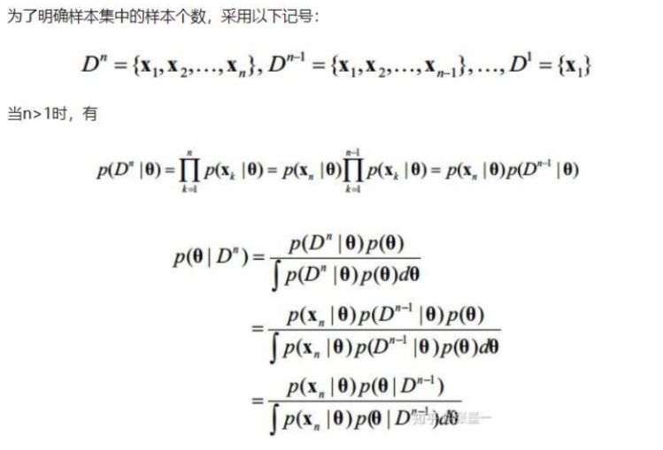
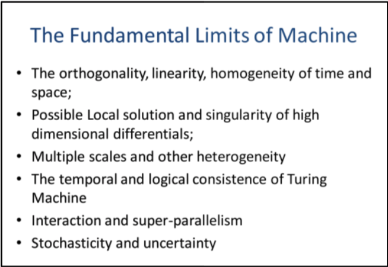
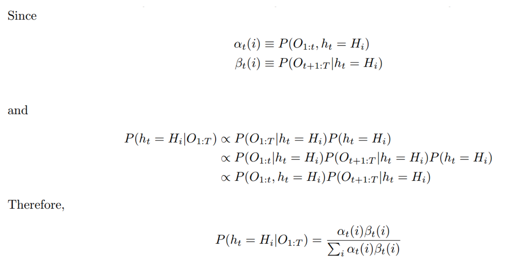
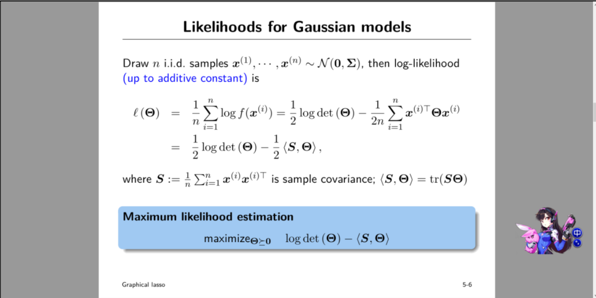

# DMProblems

######All for exams, not for sure

#### Learning & Search

##### 1) Why all learning problems are inverse problems, requiring unbounded exhaustive searches, thus ill-posed?

不适定问题：解不存在 或 解不稳定 或 解不唯一
往往数据挖掘处理的数据有着维数高、多模型混合生成、时变等复杂的特征。当我们通过一个模型去拟合数据的时候，我们实际上是在反过来学输入输出的关系。而由于数据的复杂性，往往都会忽略了一些特征，即不管我们用哪一种模型，都不可能保证完全形容出数据的所有特征，且我们也无法保证选择到最好的模型，穷举的复杂度太高了。

##### **2) Why gradient is the key mathematical assumption that we could count on in order to search? What would be the general implications for the existence of at least some continuality or locality?**

【1】梯度表示着当前状态的未来的可能趋势，对于可导连续的函数来说，梯度是前往答案的最优路径；无论是一般的梯度下降法，还是最速下降法，牛顿法，随机梯度下降法，动量加速梯度下降法，都与梯度相关。
【2】梯度是一个向量，方向与最大方向导数方向一致。既然在变量空间的某一点处，函数沿梯度方向具有最大的变化率，所以在优化目标函数时一定是要沿着负梯度方向去减小函数值。

##### **3) What is the generalizability of a mathematical process, from both expressive (smoothness) and inclusive (capacity) point of views?**

【1】Expressive：对于每个detail细节都有对应的响应与输出。
【2】Capacity：x的适用范围大

##### **4) What would be some of the solutions for such an ill-posed problem in order to yield at least some reasonable results?**

约束、正则、降维、稀疏、低秩，线性过程的组合（近似定理），梯度。总之即得到一个低复杂度的解，做简化与降维。

##### **5) What are some of the mathematical hurdles that have prevented more generalizable solutions?**

【1】不是经典的欧式问题
【2】微分的歧义性（三阶以上）
【3】局部解问题
【4】计算复杂度
【5】样本量一定，维度越高，样本在空间中的分布呈现稀疏性，导致模型参数难以正确的估计且可能出现过拟合；样本分部位于中心附近的概率越来越低，很多度量向异性的距离指标如欧氏距离的效果大打折扣，导致一些分类器表现不好。

##### **6) Why variable dependences (interactions) could become an extremely difficult and even an impossible problem? Give philosophical, mathematical, physical, computational, and numerical examples for such a singularity.**

【1】Philosophical：真理不可证明——哥德尔不完备定理；真理是人们对客观事物及其规律的正确反映
【2】Mathematical：费马大定理——n > 2时，x^n + y^n = z^n没有整数解
【3】Physical：三体问题
【4】Computational：没有真正的并行程序，图灵机就是个串行机
【5】Numerical：初值敏感——非线性动力系统的普遍行为，是确定性系统内的随机性的反应。

##### **7) Why a Euclidian-based measure would be most favored but usually impossible to obtain for a real world issue?**

先写公式、欧氏距离。欧氏距离要求正交且测度统一，可以以线性方式扩展，但是在高位多尺度、不正交不可比也不归一的数据挖掘问题下，不能满足实际要求。

##### **8) What are some of the key requirements for a real issue to be formulated as a Euclidian problem?**

分布、维数关系、正交、数字可比、测度相同。

##### **9) What would be the mathematical alternative frameworks to translate a non-Euclidian problem to mathematically appropriate solutions?**

【1】L2范数——平滑特征，同分布统一测度
【2】PCA降维——保证正交
【3】Kernel变换进入高维空间，得到线性可分的情况
【4】概率图模型表征变量联系
【5】feature分解——深度学习

##### **10) Why in general the complex and high-dimensional data (the so-called big data problem, n<<p) from the same “class” tend to have a low dimensional representation?**

【1】数据原始包含大量冗余
【2】有些变量的变化比测量引入的噪声还小，可以看做无关的
【3】有些变量和其他的变量有很强的相关性，可以找到一组新的不相关的变量
【4】从几何的观点看，降维可以看成是挖掘嵌入在高维数据中的低维线性或非线性流行，保持了原始数据的几何特性，即在高维空间中靠近的点在嵌入空间也靠近。

##### **11) Why we would prefer a low complexity model for a high complex problem?**

【1】高复杂度的model泛化能力更差且test error反而增大，出现过拟合。低复杂度的更robust
【2】奥卡姆剃刀

##### **12) What is a loss function? Give three examples (Square, Log, Hinge) and describe their shapes and behaviors.**

【1】损失函数就是用以估计模型的预测值与真实值的不一致成都，它是一个非负值函数，损失函数越小，模型鲁棒性越好，公式：

例子：Least Square用于线性回归，公式：$l = \frac{1}{2}\sum_{n=1}^N(y-X^TW)^2$ 比较smooth，但是对outliers敏感，收敛的更慢
Logistic Loss用于逻辑斯蒂回归，公式：$l_{log} = log(1 + exp(-z))$ 所欧典都有Penalty，不过置信度高的点会比较小，所以需要更多的训练样本，好处是给出标记的同时也给出了概率
Hinge Loss用于SVM，公式：$l = max(0, 1 - z)$ 并不连续，存在零区域，使得SVM的解具有稀疏性

##### **13) Using these losses to approach the linear boundary of a overlapping problem, inevitably some risks will be incurred; give two different approaches to remedy the risk using the SVM-based hinge loss as an example.**

【1】利用核函数Kernel将样本空间映射到更高维，在新的特征空间中存在可以正确划分样本的超平面，利用Kernel Function可以有效的计算内积而不需要计算出具体的Phi(x)。公式：$K(X_i, X_j) = <\Phi(X_i), \Phi(X_j)>$ 
【2】利用松弛变量，公式：$min \frac{1}{2}w^2 + C\sum_{n=1}^N \zeta_n$ 每个样本的松弛变量表征样本不满足约束的程度，C表示更重视margin还是错误多少。

##### **14) Describe biases (under-fitting) and variance (over-fitting) issue in learning, and how can we select and validate an appropriate model?**

对模型进行training和testing，找test error最小的。交叉验证也可以在训练过程中帮助选择有效的模型——数据集分为k份，每次一份做测试集其他的做训练集，$CV_k = \frac{1}{k}\sum_{i=1}^k MSE_i$ 

##### **15) How to control model complexity in the regression of a linear model? Are there supposed to be a unique low-dimensional model for a given high dimensional problem?**

【1】约束优化——L1或L2 norm降维，L2主要是平滑。其实也就是压缩维数，L1主要稀疏化。
【2】与p、n的数据分布有关，陶哲轩很牛逼

##### **16) Using the Least Square as the objective function, we try to find the best set of parameters; what is the statistical justification for the Least Square if the underlying distribution is Gaussian?**

实际上就是MLE了，证明如下（拳石那也有）：
$y - X_i^T\beta = \epsilon_i $~$N(0,1)$ 
$P(y_i|X_i) = P(\epsilon_i) = \frac{1}{\sqrt{2\pi}}e^{-\frac{(y_i-X_i^T\beta)^2}{2}}$ 
$logP(y_i|X_i) = -\frac{(y_i - X_i^T\beta)^2}{2}$
$L(\beta) = -2\sum logP(y_i|X_i) = \sum(y_i - X_i^T\beta)$ 
即最小二乘。

##### **17) Could you describe the convexity as to how it would facilitate a search? Using the Least Square-based regression and Likelihood-based estimation as the examples?**

【1】最小二乘法：从模型总体随机抽取n组样本观测后，使得估计值和观测值之差的平方和最小，损失函数是凸函数，那么任何极小值都是最小值因此可以得到最优解
【2】最大似然法：基本思想就是什么参数使得我们现在观测到的目前数据的概率是最大的。
总而言之，过程单调，外加函数凸，这些都成为了找到最优解的基础。

##### 18) Gradient Decent has a number of different implementations, including SMO, stochastic methods, as well as a more aggressive Newton method, what are some of the key issues when using any Gradient-based searching algorithm?

步长、顺序、降维
1.是不是一个凸的梯度，出现局部解后如何跳出
2.alpha的选择问题：例如SMO公式——$W=max_{\alpha}\sum_{i=1}^n\alpha_i - \frac{1}{2}\sum_{i=1}^n\sum_{j=1}^n y_iy_jK(x_i, x_j)\alpha_i\alpha_j$ 满足$0 \leq \alpha_i \leq C, \sum_{i=1}^ny_i\alpha_i = 0$ 
3.下降的速度——步长
4.如何优化加速——distribute同步增加搜索效率
5.梯度的顺序——先搜索哪个参数

##### **19) What are the five key problems whenever we are talking about a learning process (Existence, Uniqueness, Convexity, Complexity, Generalizability)? Why are they so important?**

【1】Existence：是否有解保证着模型是否收敛
【2】Uniqueness：唯一性，解是否全局唯一
【3】Convexity：凸问题我们很容易求出最优解
【4】Complexity：训练代价的衡量，太复杂会过拟合
【5】Generalizability：泛化能力，在test过程中的能力对新鲜样本的适应能力

##### 20) Give a probabilistic interpretation for logistic regression, how is it related to the MLE-based generative methods from a Bayesian perspective?

逻辑斯蒂回归直接学习了后验概率$p(y|x)$，是一种鉴别式模型，MLE则假设$p(x|y)$是高斯分布的且协方差矩阵相同，然后利用MLE来学习参数。而他们都有着相似的公式：$p(y=1|x) = \frac{1}{1 + exp\{-\theta^Tx\}}$。在没有正则项的时候，逻辑回归就是一种Naive贝叶斯。
强调先验的重要性，如果先验足够好，结果就不会太差。人类就是会自己总结各种先验，集成。
拳石：在逻辑回归的背景下，实际上MLE就是一种交叉熵的损失函数——我们假设$y|x$~$B(1,a)$，有：$p_{Y|X}(y) = a^y(1-a)^{(1-y)}$。
$L = -\sum_i logp_{Y|X}(y^{i}) = -\sum_i(y^{(i)}loga^{(i)} + (1 - y^{(i)}log(1-a^{(i)}))$ 

##### **21) What are the mathematical bases for the logics regression being the universal posterior for the data distributed in any kinds of exponential family members?**

逻辑回归服从伯努利二项分布，而二项分布属于指数族。

##### **22) Can you provide a probabilistic comparison for liner and logistic regression?**

都是线性模型，但前者是回归问题后者是分类问题，但都可以用最大似然来描述。线性回归与数据的条件概率分布有关，输出实际上是一个分布；而逻辑回归是用Naive贝叶斯的视角，输出是一个概率值。

##### **23) Why the log of odd would be something related to entropy and effective information?**

香浓熵的公式：$H = - \sum_{i=1}^np_ilogp_i$，log of odd实际上是香浓熵对p的求导！即熵的增减就与log of odd有关，即log of odd与信息的有效性有关因为熵的增减和数据的有序性有关。

##### **24) Why often we want to convert a liner to a logistics regression, conceptually and computationally?**

【1】Computationally：模型复杂度更低
【2】Conceptually：逻辑回归实际上更加的鲁棒，线性回归需要的条件比逻辑回归更多，逻辑回归对噪声的抗性也更好。且有时候具体值并没有那么重要，我们只要做到分类就好，阈值比具体数值更重要。

##### **25) Compare the generative and discriminative methods from a Bayesian point of view?**

【1】判别式模型：学习$p(y|x)$，对于给定的x对应分类为y的概率
【2】生成式模型：学习$p(x,y)$，对于给定的分类y暗示某种特定特征x的概率，假设前提$p(x|y)$~高斯分布
【3】对比：生成模型从统计的角度表示数据的分布情况，能够反映同类数据的相似度，判别模型寻找不同类别的最优分类面，反映的是异类数据之间的差异；已知数据分布、数据量不大的情况下，生成模型更棒。

##### **26) What are the most important assumption for something Naïve but still very effective? For instance for classifying different documents?**

最重要的假设就是各特征之间相互独立，即$p(x|y)$之间相互独立。对于文本分类的问题里，我们认为每个词都是独立的特征，$p(x_1,x_2,…,x_n|ad) = p(x_1|ad)p(x_2|ad)…p(x_n|ad)$。先验是同分布、相似的，样本数据分布能很好的代表样本空间分布的前提下，效果才可能会较好。

##### **27) What would be the most effective way to obtain a really universal prior? And what would be the most intriguing implications for human intelligence?**

【1】本体、知识图谱：从抽象层面看，本体最抽象，其次是知识库，最后才是知识图谱。如书本的分类就是本体，有了分类之后，可以把图书根据属性放入类别，这些数据也就构成了图书知识图谱。本体强调概念关系，知识图谱强调实体关系和实体属性值。
【2】人类智慧的基础是先验，人类智慧和机器智能的根本区别：人类智慧是遗传得到的，而机器是穷举所学习的。

##### **28) What are the key advantages of linear models? But why linear model tends not expressive?**

【1】算力需求不大、一般是凸问题有唯一解
【2】现实生活中基本上都是非线性的问题，线性模型很多时候没法解决

##### 29) What are the key problems with the complex Neural Network with complex integrations of non-linear model?

【1】非凸优化问题：优化函数容易陷入局部最优解
【2】过拟合问题：庞大的结构和参数可能使得训练集非常好，但是test error会高的离谱。

##### 30) What are three alternatives to approach a constrained maximization problem?

【1】拉格朗日法解对偶问题
【2】找到等价问题，即改变目标函数
【3】利用核函数映射到高维空间，使之得以可解。

##### 31) What is the dual problem? What is strong duality?

强对偶：当$p^* = d^*$的鞍点处时。

##### 32) What are the KKT conditions? What is the key implication of them? Including the origin of SVM?

KKT条件即使得拉格朗日对偶问题强对偶的条件，具体如下：
$\frac{\partial L}{\partial x} = 0, \frac{\partial L}{\partial \beta}=0$
$g_i(x) \leq 0$
$\alpha_i \geq 0$
$\alpha_ig_i(x)=0$
在SVM中weight能够被解出得：$w=\sum_{i=1}^m\alpha_iy_ix_i$，只有一小部分的$\alpha$不为0，即支持向量。最终模型为：$f(x) = w^Tx+b=\sum_{i=1}^m\alpha_iy_ix_i^Tx+b$

##### 33) What is the idea of soft margin SVM, how it is a nice example of regularization?

软边界的SVM允许outlier的存在，引入松弛变量并通过$C$来控制penalty，模型随之变为$min\frac{1}{2}w^2+C\sum\zeta_i$。这种情况下，同时做了原来的优化问题，加入了对松弛变量或者说outlier的考虑，而常数$C$可以控制更注重outlier的影响还是margin。

##### **34) What is the idea of kernel? Why not much additional computational complexity?**

【1】核函数引入最核心的问题就是，原来的SVM作为一个线性分类器无法对非线性的数据分布划分，因此需要投影到高维空间中使得那个特征空间存在一个超平面划分数据。而核函数$K(X_i, X_j) = \Phi(X_i)^T\Phi(X_j)$用来表示高维空间向量的内积。
【2】如果没有核函数我们需要首先计算高维空间中的向量$\Phi(X)$而这个向量可能是非常巨大的。有了核函数我们就不需要显式的计算出高维空间的这个向量了。

##### 35) What is the general idea behind the kernel? What key computation do we perform? Why is it so general in data modeling?

【1】要把数据映射到高维的特征空间，使得可以被一个超平面划分
【2】$K(X_i,X_j) = \Phi(X_i)^T\Phi(X_j)$计算内积
【3】从非线性转化为了线性的凸优化问题。

##### **36) Why we often want to project a distance “measure” to a different space?**

维数太高、不正交的空间里我们通过PCA等合并，希望得到一个可解的欧式问题，因为一般的实际数据都是非欧式空间的。

##### **37) What a Turin machine can do? What some of the key computable problems a Turin machine can do?**

【1】人们提出的所有计算模型都能够用图灵机模型模拟，直观上讲，所为计算就是计算者对着一条无限延长的纸带上的0和1执行操作。图灵机是一种为可解问题设计的一种计算装置，用其来计算所有可能想象到的可计算函数。
【2】图灵证明，只有图灵机能解决的问题，实际计算机才能解决。因此图灵机的能力概括了数字计算机的计算能力。图灵机等计算模型均是用来解决”能行计算“问题的，理论上的能行性隐含着计算模型的正确性，实际实现的情况下还包含时间和空间的有效性。

##### **38) What a Turin machine cannot do? What some of the key computable problems a Turin machine cannot do?**

【1】停机问题在图灵机上是不可判定问题
【2】二阶逻辑上不可判定问题做不出来、图灵机做不到真正的并行

##### **39) Give your own perspectives on the Hilbert No.10 problem in the context of computational limit.**

有些问题就是不可解的，我们在基础的层面上就被限制着，存在着无法逾越的极限。

##### **40) Give your own perspectives on the Hilbert No.13 problem in the context of mathematical limit.**

我们可不可能把高维的、复杂的东西用低维的方式表达。

##### **41) Discuss human intelligence vs. Turin machine as to whether they are mutually complementary, exclusive, or overlapping, or contained into each other one way or another.**

可计算理论是让我们认清了图灵机的界限，即人类无法通过机械计算得出结论的界限在哪儿，而非人类的极限，人类的极限是哲学范畴的问题；如果我们认同人类的大脑是个计算模型，那么按照哥德尔不完备定理来说，一定也存在人类无法判断是真是假的东西。遗憾的世界。

##### **42) Explain Bayesian from a recursive point of view, to explain the evolution of human intelligence.**

##### **43) What are computational evolutional basis of instinct, attention, inspiration, and imagination?**

从贝叶斯的角度来回答：先验给了人类对接下来发生事件概率的基本预测与偏向，这是我们的所谓instinct的来源。人类的先验就这样传递着，在成长中一步步的完善。

##### **44) Explain the core idea of machine learning to decompose a complex problem into an integration of individual binary problems, its mathematical and computational frame works.**

虽然机器学习的算法多种多样，但实际上内在的逻辑却是互通的。复杂的问题可以被简单的部分的组合所表示，阿诺德首先奠定了理论基础：机器学习这个二元边界问题可以用sigmoid这种概率模型来表示。

##### **45) What are the limitation of Euclidian (Newtonian) basis, from the space, dimension, measure point of view?**

时间和空间的正交、线性和同质性，可能的局部解，异构性等等。

##### **46) Why differentials of composite non-linear problems can be very complex and even singular?**

数学形式上看，神经网络就是一个多层的复合函数，复合函数的导数非常复杂的时候很可能进入混沌状态（初值敏感问题），会是奇异的。

##### **47) What is the basis of Turin halting problem? And why temporal resolution (concurrency) is a key for logics and parallelism?**

【1】停机问题即是否存在程序P，对于任意输入程序w，判断w在有限时间内结束或死循环。这个问题在图灵机上是不可判定问题，因为图灵机是串行机。
【2】图灵机本质上先后顺序逻辑的，并不存在真正的并行。

##### **48) What is mathematical heterogeneity and multiple scale?**

【1】异构：就是所谓的差异、差别。总体常常由多个异构的子总体混合而成，因此模型设定和选择上尽可能的考虑放宽同质性总体假设。RNN基本上都是异构的，每个状态都有自己的scale。
【2】Multiple scale：图像金字塔很重要，能够将不同scale的图像送入网络提取出不同scale的特征做融合，对网络性能提升极大。

##### **49) Explain convexity of composite functions? How to reduce local solutions at least in part?**

【1】复合函数从理论上说是非凸问题，但是有些时候是凸函数。深度学习也因此很可能落到局部解
【2】两种方法：1.用ReLU等激活函数；2.将网络切分成凸块，得到更全局的解

##### **50) Why local solution is the key difficulty in data mining, for more generalizable learning?**

复合函数基本上都非凸，有很多局部解。

#### Probabilistic graphical model

##### 1) Compare the graphical representation with feature vector-based and kernel-based representations;

【1】基于向量：假设数据独立、正交且归一化，需要做特征工程，在欧式空间内
【2】基于核函数：即在提取高维空间的特征，把数据投影到了高维空间中，使得data可分

##### **2) Explain why sometime a marginal distribution has to be computed in a graphical model;**

减少变量、减低复杂度，省掉部分隐变量的影响，也是执行其他任务的先决条件。

##### **3) Why class labels might be the key factor to determine if presumptively different data distributions can be indeed discriminated?**

【1】监督学习中训练数据对应的标签质量至关重要，标签错误就不可能有好的模型了
【2】降低分类精度：标签噪声对分类器的预测性能的影响非常大
【3】增加模型复杂度：训练数据中有噪声存在时，例如决策树，尺寸就会相应增加
【4】集成学习也会受到标签噪声的影响

##### **4) Why knowledge-based ontology (representation) be a possible solution for many prior-based inference problems?**

知识图谱是把所有不同种类的信息连接在一起而得到的关系网络，提供了从”关系“角度分析问题的能力，模拟人类的逻辑推理能力。从逻辑角度看，这是一种从整体架构上了解数据的方法，帮助我们对层级的知识有更好的掌握。从人类理解的角度看，标准的知识图谱可以产生合理的标签，给我们一个更好的先验。

##### 5) Why a graphical model with latent variables can be a much harder problem?

隐变量的具体结构是不知道的，我们只能用EM算法估计的计算出一个接近的最优解，且问题并不是凸问题，隐变量也只能通过估测的方法得到。

##### 6) What is the key assumption for graphical model? Using HMM as an example, how much computational complexity has been reduced because of this assumption?

【1】条件独立 + 马尔科夫性质
【2】以HMM为例，如果没有独立的假设，那么复杂度是指数级的$O(K^T)$，但用HMM模型，复杂度变为$O(TK^2)$。

##### 7) Why does EM not guarantee a global solution? What is a simple proof for that?

最大的问题在于$maxE(Likelihood) \neq max(Likelihood)$，而隐变量未知的情况下，我们是通过似然估计隐变量最可能的取值的。另外EM算法基于Jesen不等式，而这个不等式假设函数f是凸函数。然而实际情况下却并不一定如此。

##### 8) Why is K-mean only an approximate and local solution for clustering?

K-means是GMM-EM的一个特殊情况，而EM都不能保证global的解。

##### 9) How to interpret the HMM-based inference problem from a Bayesian perspective, using the forward/backward algorithm?

HMM Forward : $\alpha_t^k = p(x_t|y_t = k)\sum_i\alpha_{t-1}^ia_{i,k}$
HMM Backward : $\beta_t^k = \sum_ia_{k,i}\beta_{t+1}^ip(x_{t+1}|y_{t+1}=i)$
HMM的向前算法是一个人类方法，用以更新先验，而向后算法则是机器方法，更加关注数据，找到哪个数据最合适label。

##### 10) Show how to estimate a given hidden state for a given series of observations using the alpha and beta factors;

##### **11) How a faster inference process would be constructed, given a converging network?**

很多source使得error消失，只有prominent的部分留下了，收敛速度会变得更快。

##### **12) How can an important node (where inference can be significantly and sensitively affected) be detected using an alpha and a beta process?**

只需要看$\alpha_t\times\beta_t$的分布，使得结果准确的节点就是所谓的重要的节点。

##### **13) Why often an alpha process (forward) is more important than beta (backward)?**

Alpha的过程表示着先验，对人类来说非常重要。如果先验十分正确，甚至其他的support都不再必要。

##### **14) What are the key differences between an alpha and a beta process from human and machine intelligence point of views?**

【1】人类：先验能够很快的更新，不需要经过很多的数据来理解序列。
【2】机器：exhausting的问题，搜索所有的可能性，利用数据来最大化似然。

##### **15) How data would contribute to the resolution of an inference process from a structural point of view?**

数据是我们先验推理的向导，好的数据也能给我们好的先验，让我们更好的分类。

##### 16) For a Gaussian graphical model, what is the implication of sparsity for such a graphical model? How is such sparsity achieved computationally?

【1】我们想利用少数的变量关系得到整体的分布
【2】正则化、压在一起，类似PCA之类的，让高斯分布变得更紧。利用SVD简化计算，剪枝来稀疏化网络

##### **17) Explain the objective function of Gaussian graphical model? Thus the meaning of MLE?**

##### **18) How a row or column-based norm (L1 or L2) can be used to construct hub-based models? And why this might be highly applicable?**

我们需要稀疏化的模型，集中于重要的模型参数上而不是所有参数。Hubs是模型稳定、determined的地方。

##### **19) How Gaussian graphical model be used to model a temporally progressive problem? Why still a simple 2d matrix compression problem can still be very demanding computationally?**

【1】图模型是对整体结构的一种model，我们需要比较GGM中的节点来看这个动态的过程
【2】我们尝试比较的是两张图，图同构的问题是NPC的，我们需要比较拓扑结构而不只是独立的节点。

##### **20) Why a spectral or nuclear norm would be better than Frobenius norm to obtain a sparse matrix?**

核范数：矩阵奇异值的求和
谱范数：矩阵的$A^TA$的最大特征值开方
Frobenius范数：$\sqrt{trace(A^TA)}$
核范数可以用来约束低秩，因为rank的凸近似就是核范数。

#### Dimension reduction and feature representation

##### 1) PCA is an example of dimensional reduction method; give a full derivation of PCA with respect to its eigenvectors; explain SVD and how it is used to solve PCA;

找到协方差矩阵最大的D个特征值，SVD是最小化协方差矩阵、得到对角阵的方法。最大化方差，即找到对角化矩阵的特征矩阵P，对$\frac{1}{n}v^TXX^Tv$使得各分量最”离散化“，从而得到良好的data结果。

##### 2) Compare regular PCA with the low-ranked PCA, what would be advantage using the low-ranked PCA and how it is formulated?

PCA在数据分布均匀的情况下并不适用，强行切割会导致失去了太多的信息。稀疏化PCA使用核范数，soft的渐进的PCA，损失的信息也更少。

##### **3) What is the difference between a singular value and its Eigen value? Explain the resulting singular values of a SVD for how the features were originally distributed;**

【1】奇异值是对非方阵也可以求解的，有$A^TAv=\lambda v$，即$||Av||^2=\lambda$。所以有$\lambda=d^2$。
【2】冗余的特征很多时，PCA非常有效。但假设原来的特征就非常informative，特征相互独立，PCA的效果并不会很好。

##### **4) What is the key motivation (and contribution) behind deep learning, in terms of data representation?**

多数的分类回归都是浅层结构的算法，但是深度学习可以通过学习一种深层的非线性网络结构，针对复杂问题逼近，表征输入数据分布式表示，并展现了强大的从少数样本集中学习数据本质的能力。其实质是通过构建具有很多隐层的机器学习模型和海量的训练数据，来学习更有用的特征，从而提升最终的分类或预测的准确性。

##### **5) Compare the advantage and disadvantage of using either sigmoid or ReLu as an activation function?**

Sigmoid：作为非线性函数，它能够比ReLU表示更多，但是会产生梯度消失的问题，且计算指数较慢
ReLU：计算快，没有梯度消失的问题，但是表示的东西是线性的，比较simple

##### **6) Discuss matrix decomposition as a strategy to solve a complex high dimensional problem into a hierarchy of lower dimensional combinations?**

剪枝、降维算法都是为了稀疏性。

##### **7) Discuss convexity of composite functions, what mathematical strategies might be used to at least reduce local solutions?**

深度学习本质上就是一个深层的复合函数，这也是导致局部解的原因。
策略：ReLU等激活函数、神经网络分块

##### **8) Why normally we use L2 for the input layers and L1 for the actual modeling? Explain why still sigmoid activations are still used for the output layers?**

【1】L2：使得输入更加的smooth，因为很多特征向量长度非常大，L2能够较好的使其平滑。
L1：为了稀疏性，实际model的时候我们需要剪掉很多不必要的连接，L1就可以做得到。
【2】毕竟是一个非线性的激活函数，能表示更多东西。且是逻辑回归的根本，从熵的角度重新看待了分布之间的距离。

##### 9) What would be the true features of an object modeling problem? Give two examples to highlight the importance of selecting appropriate dimensions for feature representations;

【1】model的选择、数据的拓扑结构、梯度消失爆炸问题、记忆问题（如RNN与LSTM）、计算复杂度、过拟合和欠拟合等等。本质上还是如何让深度网络学习到真正的特征，并模型化。
【2】例子1.人脸表情是三维的，但是心情是高维的；2.布林模仿算法：需要8位的真值表，3D

##### **10) Why does the feature decomposition in deep learning then a topological recombination could make a better sampling? What would be the potential problems making deep learning not a viable approach?**

【1】深度学习能够把data分解到原始的部分，这些部分可以与其他部分相结合，构成更好的feature特征。这增加了样本容量，也使得自己产生sample变得可能如GAN。
【2】问题：局部解问题、梯度消失问题

##### 11) Explain the importance of appropriate feature selection being compatible with model selection in the context of model complexity;

特征应该与model的表示能力兼容，否则会出现欠拟合或者过拟合的问题。高维数据更可能过拟合，所以数据特征的选择也需要根据模型的不同而改变。

##### **12) What would be the ultimate and best representation for a high dimensional and complex problem? How this might be possibly achieved?**

【1】一切都需要是可泛化、结构化的。在结构、逻辑与概念的各方面重构。
【2】结合各种模型——modular combination

##### **13) How RNN can be expanded our learning to fully taking advantage of Turing machine? What RNN can whereas CNN cannot do?**

RNN：结构更像是图灵机的逻辑，可以拥有时间的信息，有记忆但CNN没有。CNN只是改变了输入得到了另一种形式的输出而已，没有思考他们是怎么连接起来的，没有输入与输出之间的逻辑关系。

##### **14) What is the central additional difficulty of RNN compared to CNN?**

RNN是种异构的、大范围的系统，blocks有自己的local loss，问题在于我们如何combine这些local loss，因为并没有global loss一说。

##### **15) In the activation function, there is a constant term “b” to learn, why it is important?**

如果没有bias项的话，不足够泛化模型样本。

##### **16) LSTM integrate short and long term processes, what is the central issue to address to achieve at least some success?**

Local & global loss。结构复杂，减少了梯度消失的可能性，欠拟合的可能性也随之下降。

##### **17) The difference between value-based vs. policy-based gradients?**

Not covered in the test

##### **18) Why dynamical programming might not be a good approach to select an optimal strategy?**

Not covered in the test

##### **19) Explain an expectation-based objective function?**

Not covered in the test

##### **20) Explain Haykin’s universal approximation theorem?**

Not covered in the test

#### General problems

##### **1) In learning, from the two key aspects, data and model, respectively, what are the key issues we normally consider in order to obtain a better model?**

模型选择、特征选择、模型特征的兼容性、降维、模型的鲁棒性、样本复杂度、模型复杂度。

##### 2) Describe from the classification, to clustering, to HMM, to more complex graphical modeling, what we are trying to do for a more expressive model?

人类利用先验来认知世界，而机器运用exhaust的搜索与函数的结合来认知。运用模型结合的方法可以得到更复杂、可表达的模型，也更加适合复杂的问题。
【1】Classification：我们用$\{+1,-1\}$。
【2】Clustering：我们用$\{0,1\}$表示类别。
【3】HMM：模型的过程和推理条件等都可以被更新。

##### 3) What are the potential risks we could take when trying to perform a logistic regression for classification using a sparsity-based regularization?

L0-Norm是NPC问题。L1的问题在于忽略了某些data，这就是一种风险。因为完全有可能我们丢弃了一些非常重要的维度。同样的也有可能会欠拟合，而$\lambda$的选择问题也会涉及到过拟合。

##### 4) Give five different structural constrains for optimization with their corresponding scalars;

L1-norm、L2-norm、核范数（奇异值之和）、Frobenius范数（奇异值之和开方）、谱范数（最大的奇异值）

##### **5) Give all universal, engineering, and computational principles that we have learned in this course to obtain both conceptually low-complexity model and computationally tractable algorithms?**

局部解、凸问题、线性化、降维（稀疏性）、低秩性、先验、马尔科夫、熵、高斯。

##### **6) Why data representation is at least equally as important as the actual modeling, the so-called representation learning?**

两者实际上是相辅相成的，数据表达需要与模型兼容且得到必要的特征来更好地进行学习。

##### **7) How does the multiple-layer structure (deep learning) become attractive again?**

深层的网络可以学习更多的东西，深层次的设计使得复杂的问题与系统能够被解决，更高维的特征可以被提取。利用线性的组合来解决非线性的问题，随着算力的提升，也就越来越火爆。

##### **8) Discuss Turin Completeness and the limit of data mining;**

奇异性问题、大规模、局部解。数据挖掘依旧以经验主义为主。

##### **9) Discuss general difficulties of using gradient for composite functions or processes;**

很多非常复杂的式子的梯度几乎可以说是不可解的，在算法的复杂度上是不可接受的，比如log里面带求和。

##### **10) What is the trend of machine learning for the next 5-10 years?**

强化学习、深度学习、并行计算。

#### Previous Exam

##### **1) SVM is a linear classifier with a number of possible risks to be incurred, particularly with very high dimensional and overlapping problems. Use a simple and formal mathematics to show and justify (a) how a margin-based liner classifier like SVM can be even more robust than Logistic regression? (b) how to control the overlapping boundary?**

【1】公式摆上。SVM允许outlier的出现，对可能出现的一些噪声点没有逻辑回归那么敏感。逻辑回归如果出现了不可分割的噪声点是没办法解决的，毕竟还是线性分类器。
【2】可以用Kernel函数映射到高维空间使其可分或者利用软SVM和松弛变量使得margin允许outlier的出现。

##### **2) Why a convolution-based deep learning might be a good alternative to address the dilemma of being more selective towards the features of an object, while remaining invariant toward anything else irrelevant to the aspect of interests? Why a linear regression with regulations would result in features which are usually conceptually and structurally not meaningful?**

【1】CNN提取信息的能力很强，能够从图片中得出本质的特征。且不仅仅只专注于特征，背景也一样。能够提取出相关”上下文“的特征信息。
【2】特征是模式与上下文的总和，线性回归无法提取。

##### **3) There are a number of nonlinear approaches to learn complex and high dimensional problems, including kernel and neural networks. (a) please discuss the key differences in feature selection between these two alternatives, and their suitability; (b) what are the major difficulties using a complex neural network as a non-linear classifier?**

【1】Kernel是将特征映射到高维空间中，使得其分布有了明显的区分特征，非常注重data。而相反神经网络将特征分解并重新学习如何建构。神经网络能够理解其中的抽象的上下文，然而明显的缺点就在于局部解的问题。
【2】局部解问题、梯度消失问题、奇异性问题和复合函数及其微分的计算与数学问题。

##### **4) For any learning problems, (a) why a gradient-based search is much more favorable than other types of searches? (b) what would be the possible ramifications of having to impose some kinds of sequentiality in both providing data and observing results?**

【1】这已经是最好的办法了。梯度的方向正是导数下降最快的方向，能够帮助我们最快的抵达最优解，且很多问题在工程上根本不可能直接得到各个数据，只能使用梯度下降的方法。
【2】记忆性的要求可能造成很多结果，数据不足可能导致欠拟合。

##### **5) Please use linear regression as the example to explain why L1 is more aggressive when trying to obtain sparser solutions compared to L2? Under what conditions L1 might be a good approximation of the truth, which is L0?**

【1】L1范数求导得到的是1，而L2求导得到的是$\beta$。可见当使用L2范数时，如果某个dimension的值很小了，随之梯度下降的值也会很小，很大时同样也会很大。但是对L1范数来说，无论什么dimension都同样是1，所以实际上是非常容易造成一个sparse的结果的。画图！
【2】序列问题，model必须要和data兼容。L0意味着需要暴力搜索，需要最完美的结合。实际的回归问题中，这决定于序列与时间，如果data混合了，时间也就不重要了。

##### **6) What is the key difference between a supervised vs. unsupervised learnings (where we do not have any ideas about the labels of our data)? Why unsupervised learning does not guaranty a global solution? (use mathematical formulas to discuss).**

【1】全局解 vs 局部解
【2】EM算法可以作为一种解释。训练集非凸时，都只能得到局部最优解。

##### **7) For HMM, (a) please provide a Bayesian perspective about the forwarding message to enhance an inference (using a mathematical form to discuss); how to design a more generalizable HMM which can still converge efficiently?**

【1】有关先验的update，$\alpha$过程human，$\beta$过程machine
【2】我们希望最终能够收敛，$\alpha$过程的进展是缓慢的，因此需要更多的scenarios。

##### **8) Using a more general graphical model to discuss (a) the depth of a developing prior-distribution as to its contribution for a possible inference; (b) how local likelihoods can be used as the inductions to facilitate the developing inference?**

【1】$\alpha$和$\beta$的深度问题，浅的话简单更快、数据强，总之数据与模型要兼容。
【2】$\alpha$受local likelihood的支撑。

##### **9) Learning from observation is an ill-posed problem, however we still work on it and even try to obtain convex, linear, and possibly generalizable solutions. Please discuss what key strategies in data mining we have developed that might have remedied the ill-posed nature at least in part? Why in general linear models are more robust than other more complex ones?**

【1】梯度下降、凸约束，先验与后验的提出。
【2】比较少的局部解与奇异性，线性组合出新的函数。

##### **10) Using logistic regression and likelihood estimation for learning a mixture model (such as the Gaussian Mixture Model), please using Bayesian perspective to discuss the differences and consistencies of the two approaches; why logistic function is a universal posterior for many mixture models?**

【1】前者对边界的data更敏感，后者是一个生成模型，对更多的data都敏感。
【2】只要是指数分布，逻辑回归就是一个universal的posterior。

#### Appendix

- HMM相关：前后向推理的公式都很好自己推，最终概率推算时有$P(y_t^k=1|x) = \frac{\alpha_t^k\beta_t^k}{p(x)}$，所以实际上最终计算的后验概率就是前后向算法所带来的。
- K-means与EM的关系：EM实际上就是在每次K-means聚类之前，先显式的指定一个样例x的类别y，而指定的方法则是样本的极大似然估计，然后反复迭代直至没有更好的y。
- 混合高斯模型GMM与EM算法：假设高斯分布之后，最大化对数似然函数的意义，就在于哪个高斯分布能够最合理的安排他：
  $L(\mu,\Sigma) = \prod_{n=1}^Np(y_n;\mu,\Sigma)$。极大似然出现的问题是当隐变量引入的时候，而EM算法做的事首先推测数据来自于哪一类（E-step），并得到此类产生这一样本的概率。随后最大化新得到的Q函数（M-step），整体上看就是通过迭代来寻找最优参数$(\mu_*,\Sigma_*,\pi_*)$。[EM](https://www.cnblogs.com/bigmoyan/p/4550375.html)
- PCA Interpretation：
  在数据挖掘中，数据表示为向量。在非常高维的情况下，我们做数据的降维是非常必要的。而方法就是所谓的PCA。[PCA](https://blog.csdn.net/hustqb/article/details/78394058)